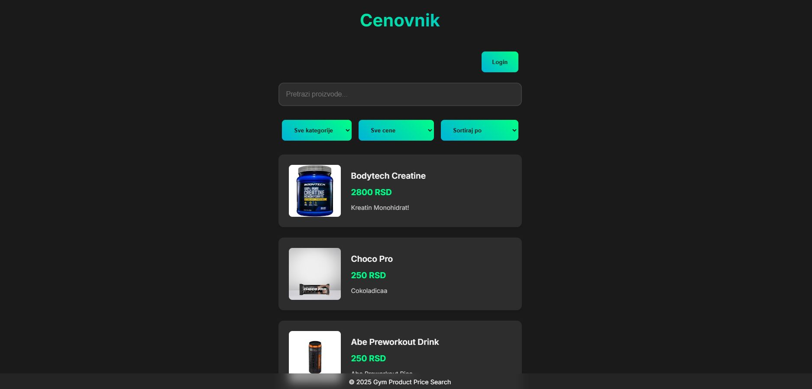

# Gym Product Search

This project is a simple web application for searching and filtering gym products. Users can search for products by name, category, and price range, as well as sort products by price.



## Project Structure

- `index.html`: The main HTML file containing the page structure and products.
- `styles/`
  - `styles.css`: CSS file containing the styles for the page.
- `scripts/`
  - `main.js`: JavaScript file containing the application logic.
- `images/`: Folder containing product images.
- `README.md`: This file with project information.
- `.env`: File with environment variables (not included in the repository).

## Features

- **Product Search**: Users can search for products by name or description.
- **Product Filtering**: Users can filter products by category and price range.
- **Product Sorting**: Users can sort products by price (ascending or descending).
- **Add Product**: Administrators can add new products.
- **Edit Product**: Administrators can edit existing products.
- **Delete Product**: Administrators can delete products.
- **Animations**: Products have animations when hovered over.

## Technologies

- **HTML**: For the page structure.
- **CSS**: For styling the page.
- **JavaScript**: For the application logic.
- **Supabase**: For backend services (authentication, database, storage).
- **Vite**: For development and build tools.

## How to Use

1. Clone the repository:
   ```sh
   git clone https://github.com/crnapagoda/gymproductssearch.git
   cd gymproductssearch
   ```

2. Install dependencies:
   ```sh
   npm install
   ```

3. Create a `.env` file and add your Supabase key:
   ```sh
   SUPABASE_KEY=your_supabase_key
   ```

4. Start the development server:
   ```sh
   npm run dev
   ```

5. Open your browser and go to `http://localhost:3000`.

## Deploy

1. Build the project for production:
   ```sh
   npm run build
   ```

2. Deploy to Vercel:
   ```sh
   vercel
   ```

## Contributing

If you want to contribute to this project, feel free to open a pull request or report an issue.

## License

This project is licensed under the MIT License.
